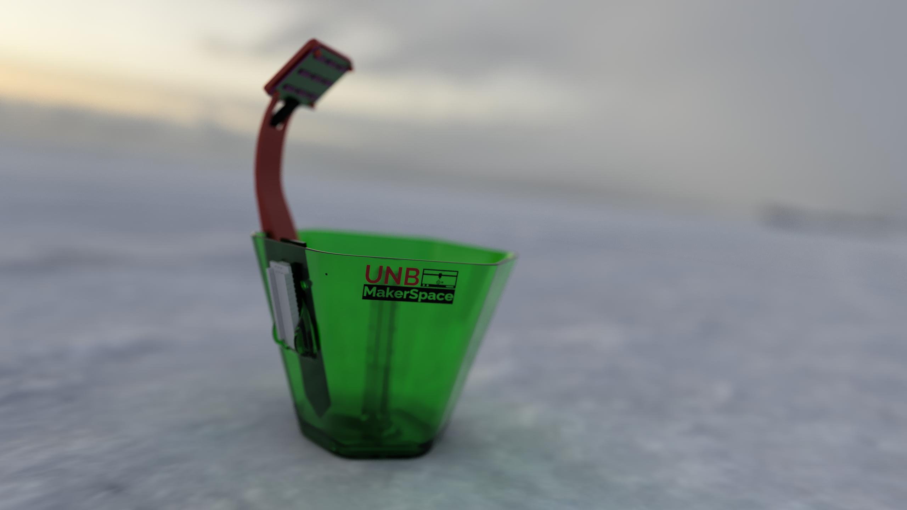

# <b>UNB Makerspace</b>:   Automated Plant Workshop
#### <i>Hosted by</i>: Josh Watson and Geoffrey Chenard <i>Funding</i>: EEF and EUS
--------------------------

### Description:
- The goal of this workshop is to create a fully automated plant capable of taking care of itself as long as it's plugged in and there's water in a reservoir.

### To Do:
- Create schematic
- Create build guide
- Link to editable fusion 360 files
- Create and post revised design
-
- Potential Revisions:
  - Might have to replace the 2n2222a for the pump with an AO3400 or other MOSFET
  - Add pull-up resistors for transistor/MOSFET
  - Add reverse current diode for pump [probably not too important]
  - Add smoothing capacitor for pump
  - Potentially add current limiting / pullup resistor for pump
  - Modify tolerances for LED Holder and the Arm
  - Modify the electronics holder so the fit better, add holder for perfboard

### Materials:
##### Electronics
Fabricated Boards:
- 1 x Arduino Nano
- 1 x LED Array PCB
- 1 x Sisterboard 

Components: 
- 9 x 5730 (or other) SMD LEDs
- 9 x 50 ohm 1/4 W resistors (can increase this number to decrease brightness)
- 1 x Capacitive Soil Hygrometer
- Cabling
- 4 x 1K ohm resistor
- 4 x 10K ohm resistor
- 4 x AO3480 N-Trench MOSFET
- 1 x SMA "M4" 1n1Diode
- 

-
1 x 1/8" PVC tubing cut to length
- 1 x 3D printed pot
- 1 x 3D printed LED holder

### Building Instructions:
